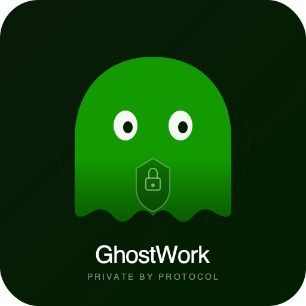

# GhostWork: Private Freelancer Payment Protocol

**Your rate is nobody's business.**

A privacy-first freelancer payment dApp on **Canton L1**. Clients hire freelancers through private contracts where each freelancer's rate, scope, and payments are invisible to other freelancers. An auditor can verify payment correctness without seeing any individual commercial terms.

Built for the **ETHDenver 2026 Canton Network Bounty**.

<p align="center">
  
</p>

---

## The Problem

On Upwork, Fiverr, and every blockchain freelance platform, contract terms are either visible to everyone or controlled by a central intermediary. Freelancers can't protect their rates. Clients can't protect their spending. No existing blockchain solution offers cryptographic privacy for this.

## What Canton Uniquely Enables

Canton's **sub-transaction privacy** means when a Client creates a contract with Freelancer A, Freelancer B's participant node **never receives any data** about it. This isn't access control or client-side filtering -- the data physically never reaches them. No other blockchain does this.

## Privacy Model

| Party | Sees | Does NOT See |
|-------|------|-------------|
| **Ethereum Foundation** (Client) | All own contracts, all payments | Nothing hidden from client |
| **Nidhi** (Freelancer A) | Only own contract + payments | Akash's contract, rate, payments |
| **Akash** (Freelancer B) | Only own contract + payments | Nidhi's contract, rate, payments |
| **Eve** (Auditor) | Aggregate totals only | Individual rates, descriptions, freelancer names |

---

## Architecture

```
React UI (Party Switcher) --> Canton JSON Ledger API v2 --> Daml Smart Contracts --> Canton L1
```

### Daml Contract Templates

**4 templates** enforce the privacy model at the protocol level:

| Template | Signatories | Observers | Purpose |
|----------|-------------|-----------|---------|
| `ProjectProposal` | Client | Freelancer | Propose-accept pattern. Only the target freelancer sees it |
| `ProjectContract` | Client + Freelancer | -- | Private agreement. Other freelancers' nodes never receive it |
| `PaymentRecord` | Client + Freelancer | -- | Immutable payment proof. Visible only to the pair |
| `AuditSummary` | Client | Auditor | Aggregate totals only. Auditor never sees individual records |

### Contract Lifecycle

```
Client creates ProjectProposal
       |
       v
Freelancer accepts --> ProjectContract (Active)
       |
       v
Freelancer submits milestone --> Client approves --> PaymentRecord created
       |                                                    |
       v                                                    v
All milestones done --> Contract status = "Completed"   Immutable receipt
       |
       v
Client generates AuditSummary --> Auditor sees totals only
```

---

## Docker Containers

### Local Development (on your machine)

When you run `docker compose up`, two containers are created:

| Container | Image | Port | Purpose |
|-----------|-------|------|---------|
| `cantonlance-sandbox` | `cantonlance-dev` | 6865 (gRPC), 6870 (JSON API), 5173 (frontend) | Canton single-node sandbox. Compiles Daml, runs the Canton ledger with JSON Ledger API. Includes a `socat` bridge to expose the API (sandbox binds to localhost only inside Docker) |
| `cantonlance-frontend` | `cantonlance-dev` | Shares sandbox network | React frontend dev server. Runs `npm install && npx vite` on port 5173 inside the sandbox's network namespace |

The `cantonlance-dev` image is built from `Dockerfile.dev`:
- **Base**: Eclipse Temurin JDK 21 (Ubuntu)
- **Installed**: Node.js 20, Docker CLI, Daml SDK 3.4.10
- **Supports**: Both AMD64 and ARM64 (Apple Silicon) -- auto-detects architecture

### Canton DevNet (on remote server)

On the DevNet server (e.g., DevNet5 at 136.112.241.18), the Canton validator stack runs **6 containers**:

| Container | Image | Port | Role |
|-----------|-------|------|------|
| `splice-validator-participant-1` | `canton-participant:0.5.12` | 7575 (internal) | **Canton participant node**. Hosts our parties, stores contracts, processes transactions. Connects to the Canton Network global synchronizer |
| `splice-validator-validator-1` | `validator-app:0.5.12` | 5003 (internal) | **Validator app**. Handles network onboarding, synchronizer registration, and Canton Network protocol compliance |
| `splice-validator-nginx-1` | `nginx:1.27.1` | 80 (exposed) | **Reverse proxy**. Routes by Host header: `json-ledger-api.localhost` -> `participant:7575`. This is what our SSH tunnel connects to |
| `splice-validator-postgres-splice-1` | `postgres:14` | 5432 (internal) | **Database**. Stores ledger state, transaction history, and party data for the participant node |
| `splice-validator-wallet-web-ui-1` | `wallet-web-ui:0.5.12` | 8080 (internal) | **Wallet UI**. Canton Network wallet interface (part of validator stack, not used by GhostWork) |
| `splice-validator-ans-web-ui-1` | `ans-web-ui:0.5.12` | 8080 (internal) | **ANS UI**. Canton Network naming service interface (part of validator stack, not used by GhostWork) |

### How the Containers Connect

```
LOCAL DEVELOPMENT:
  Browser --> Vite proxy (localhost:5173)
                |
                +--> /api/local --> cantonlance-sandbox:6870 (socat bridge)
                                        |
                                        +--> Canton sandbox (localhost:6870 inside container)

DEVNET DEPLOYMENT:
  Browser --> Vite proxy (localhost:5173)
                |
                +--> /api/devnet --> SSH tunnel (localhost:9090)
                                        |
                                        +--> DevNet nginx (port 80)
                                              |
                                              +--> Host: json-ledger-api.localhost
                                                    |
                                                    +--> participant:7575 (JSON Ledger API)
```

---

## Setup & Installation

### Prerequisites

- **Docker Desktop** (8GB+ RAM allocated)
- **Node.js 20+** (for running the frontend on host)
- **Git**

### Step 1: Build the Dev Image

```bash
git clone <repo-url>
cd freelancer-dapp

# Build Docker image with JDK 21, Node.js 20, Daml SDK 3.4.10
docker build -f Dockerfile.dev -t cantonlance-dev .
```

This takes ~5 minutes on first build. The image supports both AMD64 and ARM64 (Apple Silicon).

---

## Option A: Local Sandbox (Recommended for Demo)

The sandbox runs a single-node Canton ledger inside Docker. The frontend runs on your host machine and connects through a Vite proxy.

### Step 2a: Start the Sandbox

```bash
docker compose up -d sandbox
```

Wait for it to become healthy (~60 seconds). The sandbox:
- Compiles the Daml contracts
- Starts the Canton sandbox with JSON Ledger API on port 6870
- Runs a `socat` bridge so the API is accessible from the host

Check health:
```bash
docker inspect --format='{{.State.Health.Status}}' cantonlance-sandbox
# Should return: healthy
```

### Step 3a: Run Setup Script

```bash
./setup-local.sh
```

This script:
1. Waits for the sandbox to be ready (60 retries, 2s intervals)
2. Uploads the compiled DAR (Daml Archive) to `/v2/packages`
3. Allocates 4 parties via `POST /v2/parties`: `Client_EthFoundation`, `FreelancerA_Nidhi`, `FreelancerB_Akash`, `Auditor_Eve`
4. Creates users with `ActAs`/`ReadAs` rights via `POST /v2/users`
5. Writes `freelancer-app/frontend/public/local-config.json` with party IDs

### Step 4a: Start the Frontend

```bash
cd freelancer-app/frontend
npm install
npx vite
```

Open **http://localhost:5173** in your browser.

The Vite dev server proxies `/api/local` to the sandbox at `127.0.0.1:6870`. The frontend auto-detects the local config and connects.

### Verify It Works

```bash
# Check Canton API is reachable through the proxy
curl -s http://localhost:5173/api/local/v2/version | python3 -c "import sys,json; print(json.load(sys.stdin)['version'])"
# Should print: 3.4.10
```

---

## Option B: Canton DevNet Deployment

Deploy to the Canton Network DevNet for a real multi-node environment with JWT authentication.

### Prerequisites

- SSH access to a DevNet server (provided by Canton Network for hackathon)
- The DevNet validator stack must be running (`start.sh` completed, IMAGE_TAG=0.5.12)
- `expect` installed on your machine (`brew install expect` on macOS)

### DevNet Deployment Script

The `deploy-devnet.sh` script automates the entire deployment in 8 steps:

```bash
# Interactive mode (prompts for server IP and account number)
./deploy-devnet.sh

# Direct mode (DevNet5 example)
./deploy-devnet.sh 136.112.241.18 5

# Custom tunnel port
TUNNEL_PORT=9090 ./deploy-devnet.sh 136.112.241.18 5
```

**What the script does:**

| Step | Action | Details |
|------|--------|---------|
| 1 | Check DAR exists | Auto-builds if Docker container running |
| 2 | Verify validator health | SSH to remote, `docker inspect` participant + validator |
| 3 | Open SSH tunnel | `localhost:9090` -> DevNet nginx:80 |
| 4 | Upload DAR | `POST /v2/packages` with admin JWT |
| 5 | Allocate 4 parties | `POST /v2/parties` (Client, FreelancerA, FreelancerB, Auditor) |
| 6 | Create users | `POST /v2/users` with ActAs/ReadAs rights |
| 7 | Generate JWT tokens | HS256 tokens (30-day expiry), writes `devnet-config.json` |
| 8 | Verify deployment | Queries active contracts per role |

### Step-by-Step Manual Deployment

If you prefer to deploy manually or troubleshoot:

#### 1. Open SSH Tunnel

```bash
# Option A: Use the tunnel script (stays open, includes keep-alive)
./tunnel-devnet.sh 136.112.241.18 5

# Option B: Manual SSH tunnel
ssh -o ServerAliveInterval=30 -L 9090:127.0.0.1:80 dev5@136.112.241.18
# Password: CantonDev5!
```

Keep this terminal open. The tunnel maps `localhost:9090` to the DevNet server's nginx on port 80.

#### 2. Verify API Access

```bash
curl -s -H "Host: json-ledger-api.localhost" http://localhost:9090/v2/version
# Should return: {"version":"3.4.12-SNAPSHOT", ...}
```

#### 3. Deploy

```bash
TUNNEL_PORT=9090 ./deploy-devnet.sh 136.112.241.18 5
```

#### 4. Start the Frontend

```bash
cd freelancer-app/frontend
npm install
npx vite
```

The Vite dev server proxies `/api/devnet` to `127.0.0.1:9090` with the required `Host: json-ledger-api.localhost` header. The frontend auto-detects both local and DevNet configs and lets you switch environments live.

### DevNet Authentication

DevNet uses **HS256 JWT tokens** with the shared secret `unsafe` (DevNet-only, not for production):

| Field | Value |
|-------|-------|
| Algorithm | HS256 |
| Secret | `unsafe` |
| Audience | `https://ledger_api.example.com` |
| Scope | `daml_ledger_api` |
| Expiry | 30 days from generation |

Each party gets its own JWT token with the `sub` field set to their user ID (e.g., `cantonlance-client`). Tokens are written to `devnet-config.json` by the deploy script.

### DevNet Validator Setup (One-Time)

If you need to set up the validator from scratch on a DevNet server:

```bash
# 1. SSH to the server
ssh dev5@136.112.241.18

# 2. Get an onboarding secret from the sponsor SV
curl -X POST https://sv.sv-1.dev.global.canton.network.digitalasset.com/api/sv/v0/devnet/onboard/validator/prepare

# 3. Navigate to the validator stack
cd ~/splice-node/docker-compose/validator/

# 4. Start the validator
IMAGE_TAG=0.5.12 \
SPONSOR_SV_URL=https://sv.sv-1.dev.global.canton.network.digitalasset.com \
MIGRATION_ID=1 \
PARTY_HINT=ghostwork-dev5 \
ONBOARDING_SECRET=<secret-from-step-2> \
./start.sh

# 5. Wait for all containers to be healthy (~2-5 minutes)
docker ps
```

---

## Running Daml Tests

The Daml script test proves the privacy model programmatically:

```bash
docker run --rm \
  -v $(pwd)/freelancer-app/daml/freelance:/workspace \
  cantonlance-dev \
  bash -c "cd /workspace && daml test --no-legacy-assistant-warning"
```

Expected output:
```
Test Summary
daml/FreelanceTest.daml:privacyTest: ok, 5 active contracts, 9 transactions.
```

This test creates contracts between Client-FreelancerA and Client-FreelancerB, then asserts:
- FreelancerA sees only 1 contract (her own), zero of FreelancerB's
- FreelancerB sees only 1 contract (his own), zero of FreelancerA's
- Auditor sees 0 contracts, 0 payments, only the AuditSummary

---

## Project Structure

```
freelancer-dapp/
|-- Dockerfile.dev              # Dev container (JDK 21, Node 20, Daml SDK 3.4.10)
|-- docker-compose.yml          # Local: sandbox + frontend services
|-- setup-local.sh              # Local: upload DAR, allocate parties, write config
|-- deploy-devnet.sh            # DevNet: full 8-step deployment via SSH tunnel
|-- tunnel-devnet.sh            # DevNet: standalone SSH tunnel helper
|-- README.md                   # This file
|-- DEMO.md                     # Presenter script for demo/judging
|-- HACKATHON_SUBMISSION.md     # ETHDenver 2026 submission details
|-- logo/                       # GhostWork branding assets
|
|-- freelancer-app/
    |-- daml/freelance/
    |   |-- daml.yaml                    # Daml SDK 3.4.10, package: cantonlance-freelance
    |   |-- daml/
    |       |-- Freelance.daml           # 4 templates: Proposal, Contract, Payment, Audit
    |       |-- FreelanceTest.daml       # Privacy model test (5 contracts, 9 txns)
    |
    |-- frontend/
        |-- index.html
        |-- vite.config.ts               # Dual proxy: /api/local + /api/devnet
        |-- public/
        |   |-- local-config.json        # Generated by setup-local.sh
        |   |-- devnet-config.json       # Generated by deploy-devnet.sh
        |-- src/
            |-- main.tsx
            |-- App.tsx
            |-- cantonlance/
                |-- cantonApi.ts              # Canton JSON Ledger API v2 TypeScript client
                |-- store.tsx                 # React Context state management
                |-- types.ts                  # TypeScript types + party definitions
                |-- CantonLanceApp.tsx         # Main app shell, navbar, hero, party tabs
                |-- ClientView.tsx            # Client dashboard (create, approve, audit)
                |-- FreelancerView.tsx        # Freelancer view (own contracts only)
                |-- AuditorView.tsx           # Auditor view (aggregate summaries only)
                |-- PrivacyComparisonPanel.tsx # 4-column privacy comparison matrix
                |-- ApiProofPanel.tsx          # Real API request/response log
                |-- DemoGuide.tsx             # 8-step guided walkthrough
                |-- CreateAccountModal.tsx    # Dynamic party creation from UI
                |-- ToastNotifications.tsx    # Toast notification system
```

---

## Tech Stack

| Layer | Technology | Version |
|-------|-----------|---------|
| Smart Contracts | Daml on Canton L1 | 3.4.10 |
| Frontend | React + TypeScript + Vite | React 18, Vite 6, TS 5 |
| Styling | Bootstrap 5 (CDN) | 5.3 |
| API | Canton JSON Ledger API v2 | 3.4.10 (local) / 3.4.12 (DevNet) |
| Dev Container | Docker (JDK 21, Node 20, Daml SDK) | ARM64 + AMD64 |
| DevNet Validator | Splice validator stack | 0.5.12 |
| Auth | HS256 JWT (DevNet only; sandbox has no auth) | -- |

### What Makes This Different from Public Chain Freelance Platforms

| Feature | Public L1 (Ethereum) | GhostWork (Canton) |
|---------|---------------------|-------------------|
| Contract visibility | Everyone sees everything | Only parties on the contract |
| Payment amounts | Public | Only client + freelancer |
| Freelancer rates | Public | Invisible to other freelancers |
| Audit access | Full individual records | Aggregate totals only |
| Privacy mechanism | None (or encryption bolt-on) | Protocol-level sub-transaction |
| Consent model | Unilateral | Propose-accept (explicit consent) |

---

## Potential Judge Questions & Answers

### Privacy & Architecture

**Q: How is this different from just filtering data in the frontend?**
> This is protocol-level privacy, not UI filtering. When the Client creates a contract with Freelancer A, Freelancer B's Canton participant node **never receives that transaction data**. It's not hidden -- it physically does not exist on their node. You can verify this by querying the JSON Ledger API directly for each party: FreelancerB's query returns zero contracts for FreelancerA's projects. The API Proof Panel in the UI logs every raw request/response to prove it.

**Q: Could you achieve the same privacy on Ethereum with encryption?**
> No, for two reasons. First, on Ethereum the encrypted blob is still on-chain -- everyone has the ciphertext, and key management becomes the trust bottleneck. Second, even with ZK proofs, the transaction graph (who transacted with whom, when, and how much gas) is public. On Canton, the transaction itself is never transmitted to non-parties. There's no ciphertext to attack and no metadata to correlate.

**Q: How does the auditor see aggregates without seeing individual contracts?**
> The `AuditSummary` template has `signatory client` and `observer auditor`. The client creates it with only aggregate fields (`totalContractsCount`, `totalAmountPaid`, `reportPeriod`). The auditor's node receives only this summary contract. It never receives any `ProjectContract` or `PaymentRecord` because it's not a signatory or observer on those templates. This is enforced by Canton -- the app can't accidentally leak individual data to the auditor.

**Q: What happens if there are 100 freelancers? Does privacy scale?**
> Yes. Each `ProjectContract` is between exactly two parties (client + freelancer). Adding the 101st freelancer creates a new bilateral contract that is invisible to the other 100. Canton's sub-transaction privacy is O(1) per contract -- each node processes only its own contracts regardless of total network size.

### Daml & Smart Contracts

**Q: Why the propose-accept pattern instead of direct contract creation?**
> In Daml, you can't create a contract that requires someone else's signature without their consent. This is a feature, not a limitation. The `ProjectProposal` has `signatory client` only -- the client can create it unilaterally. The freelancer then exercises `AcceptProposal`, which creates the `ProjectContract` with both as signatories. This guarantees genuine consent. You can't bind someone to a contract without their action.

**Q: How do payments work? Is real money transferred?**
> In this demo, `ApproveMilestone` creates a `PaymentRecord` contract (an immutable ledger entry) and updates the `amountPaid` field on the `ProjectContract`. It's bookkeeping -- a verifiable record that both parties signed. In production, this would integrate with Canton's token transfer capabilities or a payment oracle. The privacy model works the same either way: only the client and freelancer see the payment amount.

**Q: What prevents the client from overpaying or double-paying?**
> The Daml contract enforces this: `assertMsg "Total paid exceeds budget" (newAmountPaid <= totalBudget)`. Each `ApproveMilestone` checks that cumulative payments don't exceed the total budget. The `assertMsg "All milestones already completed"` guard prevents submitting more milestones than agreed. These are ledger-level invariants, not application-level checks.

### DevNet & Deployment

**Q: Is this running on a real Canton Network, or just a local simulator?**
> Both. The app supports dual environments. The local sandbox is a single-node Canton ledger for development. The DevNet deployment runs on the real Canton Network DevNet with validator stack v0.5.12, connected to the global synchronizer. Same Daml contracts, same API calls, same privacy guarantees -- just multi-node instead of single-node.

**Q: How does the DevNet deployment work?**
> The `deploy-devnet.sh` script: (1) Opens an SSH tunnel from your laptop to the DevNet server's nginx proxy, (2) Uploads the compiled DAR (Daml Archive) via `POST /v2/packages`, (3) Allocates 4 parties and creates users with `ActAs`/`ReadAs` rights, (4) Generates HS256 JWT tokens for each party, (5) Writes a runtime config that the frontend loads on startup. The frontend auto-detects both local and DevNet configs and lets you switch environments live.

**Q: What was the hardest part of the DevNet deployment?**
> The DevNet sequencers went down mid-hackathon. We had to: (1) research the current Splice version (0.5.12 vs our 0.5.10), (2) discover the migration ID changed from 0 to 1, (3) re-onboard the validator with a fresh onboarding secret from the sponsor SV, and (4) update the nginx port mapping (80 vs 8080). The deploy script now handles all of this, including automatic party lookup if allocation fails (handles idempotent re-runs).

### Developer Tooling

**Q: Is there a TypeScript SDK for Canton?**
> Not officially. We wrote one: `cantonApi.ts` (893 lines) is a fully typed TypeScript client for the Canton JSON Ledger API v2. It handles contract queries (`/v2/state/active-contracts`), command submission (`/v2/commands/submit-and-wait-for-transaction`), party management, user creation, and dynamic package ID resolution. It supports both sandbox (no auth) and DevNet (JWT Bearer tokens). This is open source and reusable for any Canton dApp.

**Q: How do I run this from scratch?**
> Three commands: `docker build -f Dockerfile.dev -t cantonlance-dev .`, `docker compose up -d sandbox`, `./setup-local.sh`. Then `cd freelancer-app/frontend && npm install && npx vite`. Under 5 minutes to a working privacy demo.

---

## Deploy Frontend on Vercel

1. **Push your repo to GitHub** (if not already).

2. **Import on Vercel**
   - Go to [vercel.com](https://vercel.com) -> **Add New** -> **Project**.
   - Import your `freelancer-dapp` repo.
   - Set **Root Directory** to `freelancer-app/frontend`.
   - Leave **Build Command** and **Output Directory** as auto-detected.
   - Deploy.

3. **After deploy**
   - The app is a static SPA with client-side routing.
   - For local or DevNet, the app expects `/local-config.json` or `/devnet-config.json` from the same origin.
   - For a live demo, add `devnet-config.json` in `freelancer-app/frontend/public/` with your DevNet party tokens and redeploy.

**One-off deploy from CLI:**

```bash
cd freelancer-app/frontend
npx vercel
```

---

## License

Copyright (c) 2026. ETHDenver 2026 Hackathon Submission.
